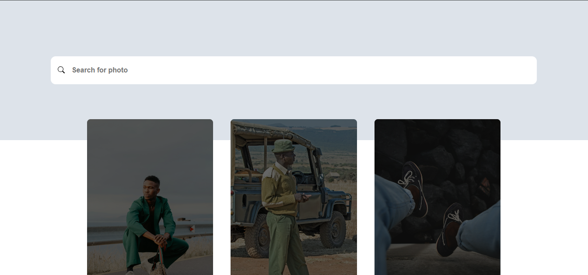
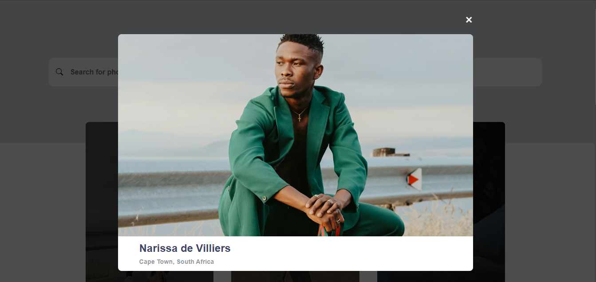

# Image Gallery App

## Description

**Image Gallery App** is a dynamic image gallery that integrates with the Unsplash API to display high-quality portrait-oriented images. It features a staggered grid layout for optimal visual presentation and includes a search functionality to allow users to browse images based on specific keywords. Clicking on any image opens a full-screen modal for an enhanced view. The app is fully responsive, providing an intuitive and smooth user experience across devices.

---

## Technologies Used

- **Frontend:**
  - Vue.js 3 for the frontend framework.
  - Vue Composition API for state management and reactivity.
  - Unsplash API for fetching images dynamically.
  - Sass for styling and creating a modular, maintainable design.

- **Backend:**
  - The app interacts directly with the Unsplash API, no dedicated backend server is required.

- **Additional Libraries:**
  - Axios for making HTTP requests to the Unsplash API.
  - Lazy loading (dynamic imports) for optimized loading of heavy components like image modals.

---

## Features

1. **Search Images from Unsplash:**
   - Users can search for images by typing keywords into a search bar. The app dynamically fetches and displays images from Unsplash that match the query.

2. **Staggered Grid Layout:**
   - A responsive, staggered grid layout displays images in a visually balanced way, despite all images having a portrait orientation.
   - The layout automatically adjusts based on screen size for optimal viewing on all devices.

3. **Image Modal View:**
   - Clicking on an image opens it in a full-screen modal for a better viewing experience.
   - The modal component is lazy-loaded to improve initial page load times.

4. **Responsive Design:**
   - The app adapts seamlessly to different screen sizes, ensuring that images are displayed beautifully on mobile, tablet, and desktop devices.

5. **Smooth Animations:**
   - Transitions and animations are added to the modal open/close behavior for a more interactive and visually appealing experience.

---

## Learnings

During the development of this project, I improved my skills on:

- **CSS Grid and Flexbox:** Enhanced skills in creating a responsive and aesthetically pleasing staggered grid layout using CSS Grid and Flexbox.
- **Sass for Styling:** Leveraged Sass to write modular and reusable styles, improving code maintainability and readability.

---

## Improvement

There are areas where the project could be further enhanced:

- **Infinite Scrolling:** Implement infinite scrolling to automatically load more images as users scroll down the page, improving the user experience.
- **Image Preloading:** Preload images to ensure smoother transitions when opening the modal.
- **Caching:** Implement caching for the API results to improve performance and reduce load times for repeated queries.

---

## How to Run the Project

### 1. Clone the Repository:

```bash
git clone https://github.com/yourusername/vue-gallery-app.git
```

### 2. Install Dependencies:

```bash
cd vue-gallery-app
npm install
```

### 3. Set Environment Variables:

VITE_UNSPLASH_ACCESS_KEY = 'your_access_key'

### 4. Run the App:

``` bash
npm run dev
```

### 6. Possible Errors:
- API Key Issues: If the images do not load, ensure that your Unsplash API key is valid and correctly set in the .env file.
- Network Errors: If the API request fails, check your internet connection or Unsplash API rate limits.

---

## Work Process

1. **Started with API Integration::**
   - The initial focus was on integrating the Unsplash API, setting up the necessary authentication, and retrieving images based on search queries.

2. **Implemented Grid Layout:::**
   - Developed a staggered grid layout using CSS Grid and Flexbox for a responsive and visually appealing image display.

3. **Added Modal and Lazy Loading::**
   - Built the image modal component with dynamic imports to enable lazy loading, optimizing performance.

4. **Final Adjustments and Optimizations:::**
   - Added search functionality, improved responsiveness, and ensured a smooth user experience across all devices.

5. **Time Taken::**
   - The project was completed in approximately 24 hours, including design, API integration, and styling.

--
## Images

